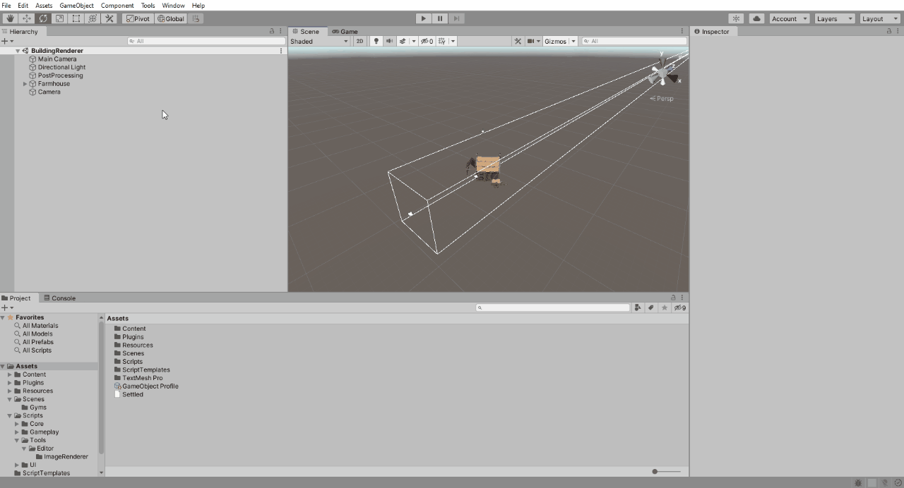
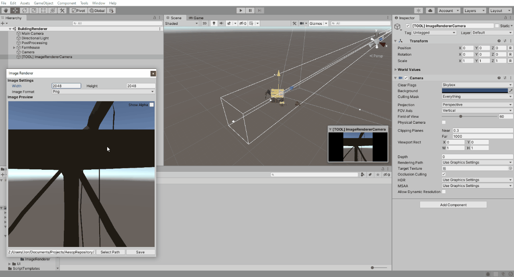
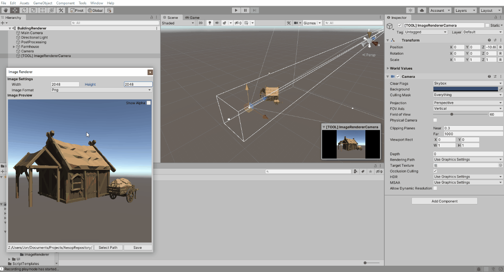

# Image Renderer
## Description
This is a very simple "render to file" utility for Unity. Using this tool you are able to position a temporary camera in your scene and then save its output to an image file. Supported image formats are jpg and png, with alpha supported for pngs.

## Features
* Supports jpg and png file formats
* Alpha channel supported for pngs
* Supports image dimensions between 1 and 2048; Images can be non-square

## How to Use
### Opening the Tool
The tool can be accessed from the Tools menu. Opening the tool will automatically create an ImageRendererCamera within your scene. Closing the Image Renderer tool will destroy the camera.

### Staging your Image
Once your ImageRendererCamera is created you are able to manipulate it as you would any other camera. Position your camera in the scene and stage the items you wish to render accordingly.

### Resizing Image
The image being captured can be resized by manipulating the width and height values within the Image Renderer window. The preview image will resize accordingly.

### Alpha Channel
The Image Renderer supports alpha channel for pngs. To render your items on a transparent background simply change the Clear Flags of the ImageRendererCamera to "Depth Only". The Image Renderer window provides an alpha channel preview that can be toggled on/off as desired.

## Known Issues
* Alpha preview is available when the jpg format is selected
* It is possible to delete the ImageRendererCamera while the Image Renderer window is open
* Camera settings are not saved between closing and opening the Image Renderer window
* The Image Renderer does not render transparency if post-processing is active on the camera
** This appears to be a feature limitation of Unity

## Meta
Created by Jon Huffman [[twitter](https://twitter.com/AtticusMarkane) &bull; [github](https://github.com/jonHuffman)]

Released under the [MIT License](http://www.opensource.org/licenses/mit-license.php).